### Información General
- **Objetivo:** Acceder a la maquina
- **IP:** 192.168.0.144
- **Hostname:** arroutada
- **Sistema Operativo:**
- **Arquitectura:**
- **Kernel:**
- **TTL:**  64 (linux)
- **Servicios expuestos:**
- **Tecnologías detectadas:** 

---
### Notas
-
---
## Writeup
---
### Hosts discovery (descubrimiento de hosts)

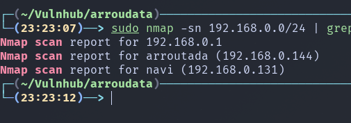
---
### Enumeración

```bash
# Nmap 7.95 scan initiated Fri Mar  6 23:25:04 2026 as: /usr/lib/nmap/nmap -p 80 -sCV -sS -Pn -vvv -oN nmap.txt -oX nmap.xml 192.168.0.144
Nmap scan report for arroutada (192.168.0.144)
Host is up, received arp-response (0.00023s latency).
Scanned at 2026-03-06 23:25:05 -03 for 6s

PORT   STATE SERVICE REASON         VERSION
80/tcp open  http    syn-ack ttl 64 Apache httpd 2.4.54 ((Debian))
|_http-server-header: Apache/2.4.54 (Debian)
|_http-title: Site doesn't have a title (text/html).
| http-methods: 
|_  Supported Methods: OPTIONS HEAD GET POST
MAC Address: 08:00:27:58:13:94 (PCS Systemtechnik/Oracle VirtualBox virtual NIC)

Read data files from: /usr/share/nmap
Service detection performed. Please report any incorrect results at https://nmap.org/submit/ .
# Nmap done at Fri Mar  6 23:25:11 2026 -- 1 IP address (1 host up) scanned in 6.80 seconds

```

| Vector | Servicio (Puerto) | Estado  | Qué permite                           | Qué intentar | Notas |
| ------ | ----------------- | ------- | ------------------------------------- | ------------ | ----- |
| 1      | http (80)         | abierto | gran abanico de vulnerabiliadades web |              |       |

 #### http 
 En esta maquina por el momento solo hay un puerto habierto, osea solo un vector de ataque que es http. 
 Al entrar a la pagina encontramos solo una imagen, sin nada en el codigo fuente de la pagina, asi que ahora hare las siguientes cosa:
 - Descargas la imagen y analizarla para buscar mensajes dentro de ella
 - Hacer fuzzing en busca de directorios

 

Esto es lo que veo al analizar la imagen, un directorio

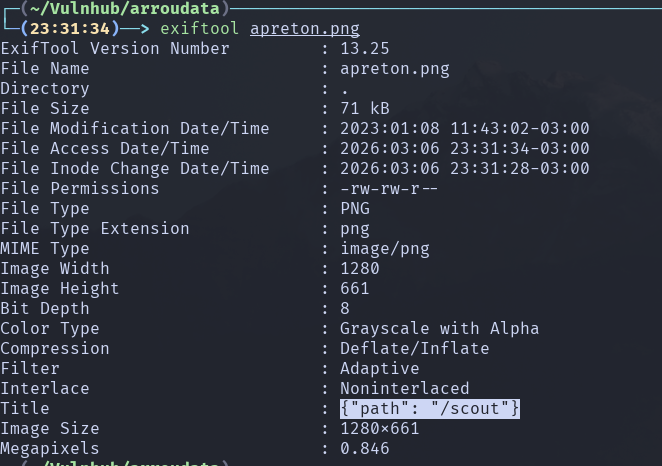

A la par que la enumeración de directorios tambien arroja el mismo directorio

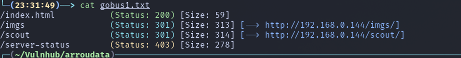

ahora tenemos una pista, tenemos un path de destino pero hay uno intermediario desconocido

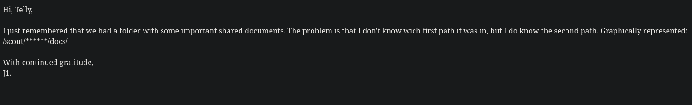

usando ffuf, pude descubir el directorios
```bash 
# Comando de ffuf
ffuf -u "http://192.168.0.144/scout/FUZZ/docs/" -w /usr/share/wordlists/seclists/Discovery/Web-Content/DirBuster-2007_directory-list-lowercase-2.3-big.txt -c

# directorio que descubrio 
j2                      [Status: 200, Size: 189767, Words: 15060, Lines: 1017, Duration: 403ms]
```

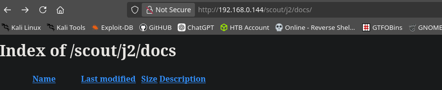

Esto es lo que encontre en el directorio 

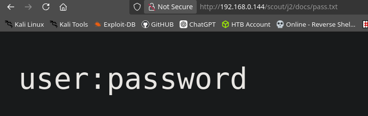


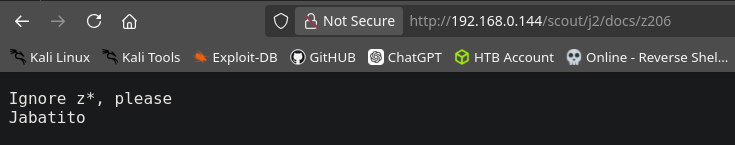

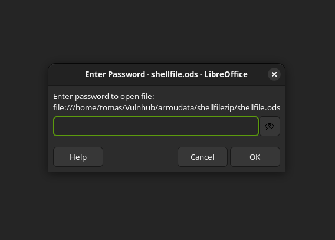

Ninguna de las cosas que encontre sirve como password y procediendo a usar office2john me salio este error

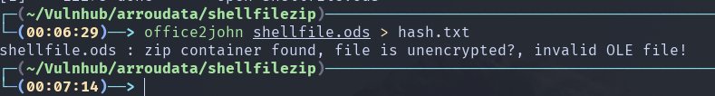

Y procedi a verificar con binwalk

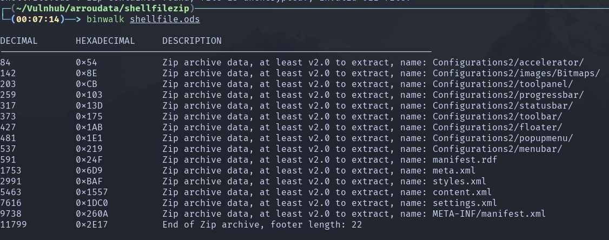

Ya sabiendo que el archivo es un .zip lo extraje pero no obtuve nada, asi que segui con el plan de extraer el hash y crackear la contraseña

Extraigo el hash

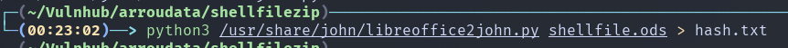 

Aqui esta la contraseña crackeada

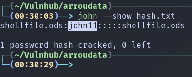

Y con la contraseña accedo al archivo y veo esto

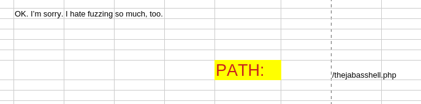

Hice fuzzing a thejabasshel.php buscando parametro y encontre el parametro a, pero arrojaba esto

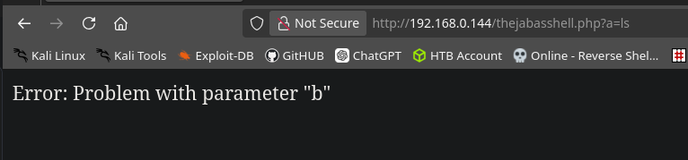

y luego de probar algunas cosas rapidas en el parametro b hice fuzzing encontrando lo siguiente

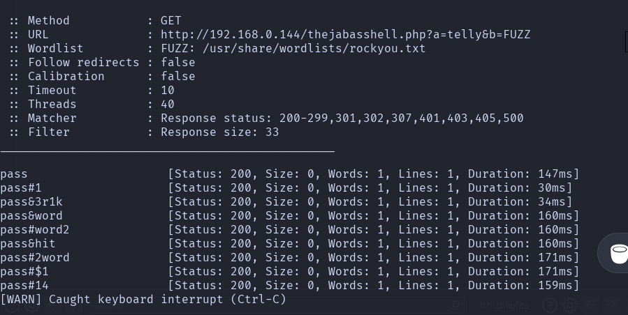

Por mi confusion pense en lo del pass.txt pensando que era algun tipo de login pero viendo documentación vi que el parametro *a* era el comando y el *b* la contraseña

Consiguiendo asi una RCE 

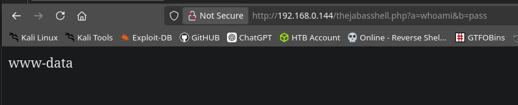

---
### Explotación
Ya teniendo una RCE me envie una shell hacia mi maquina para navegar con mas comodidad

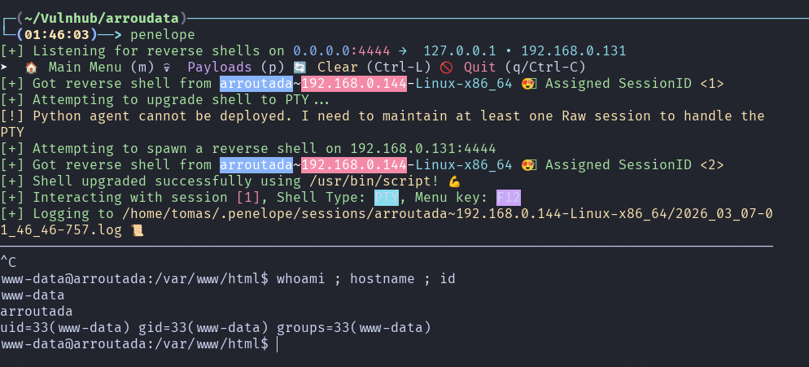

---
### Post Explotación
Despues de buscar encontramos el siguiente servicio

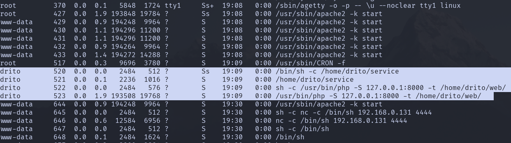

El problema es que solo esta de forma local en la maquian asi que haremos Portforwarding, para eso usaremos chisel

Primero hay que saber que arquitectura usa el sistema victima para descargar la version correcta de chisel

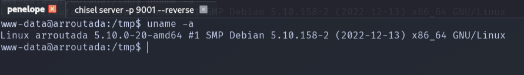

En este caso es amd64 asi que descargamos la version correspondiente

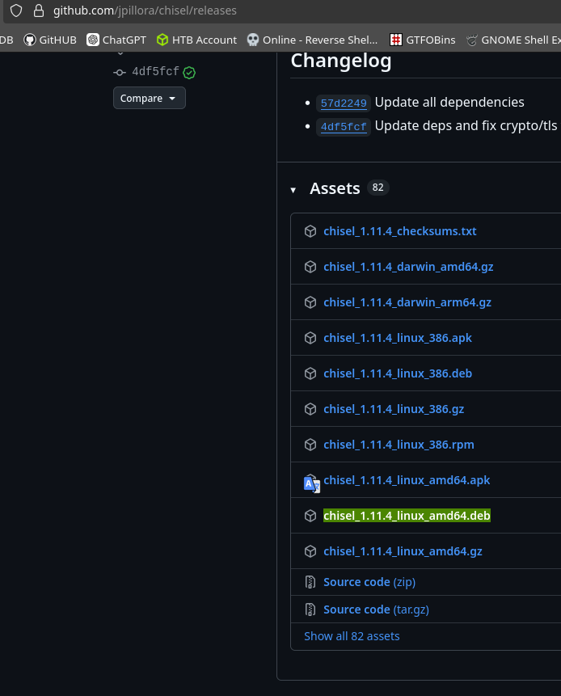

Ya con esto procedo a hacer Portforwarding y descubir una cadena de brainfuck

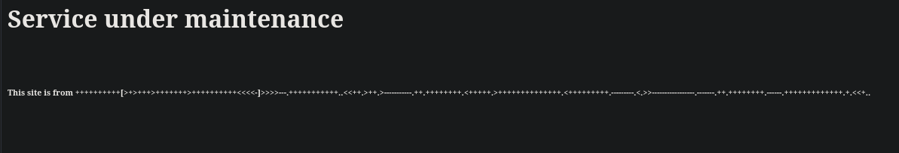

esto es lo que dice: all HackMyVM hackers!!

Esto hay en el codigo fuente 

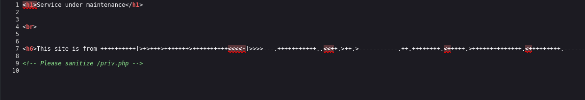

Luego de revisar el archivo me doy cuenta que devuelve  un script en php y luego de perdirle a chatgpt que me explicara esto me dijo que habia una RCE haciendo un peticion por POST diciendo que es json

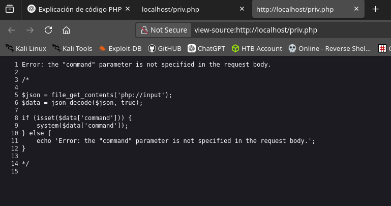

El script:
1. Lee el **JSON del request body**.
2. Lo convierte a **array PHP**
3. Verifica si existe **`command`**.
4. Si existe → ejecuta el comando con `system()`.
5. Si no → muestra el error que viste.

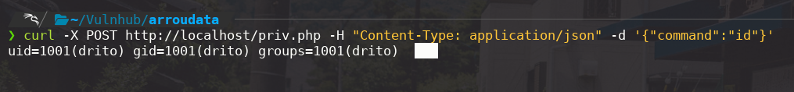

Ahora tenemos una RCE como el usaurio drito, con esto puedo proceder a obtener un terminal 

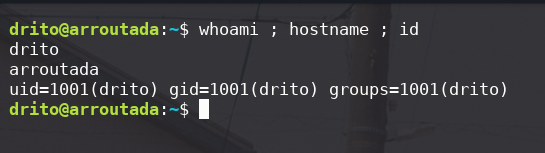

---
### Escalada de privilegios
La escalada es bastante facil ya que tenemos permitido ejecutar xargs como sudo sin contraseña

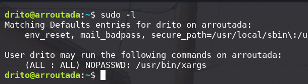

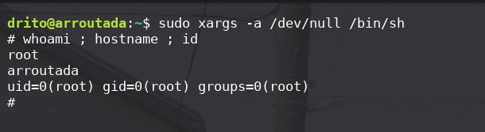
