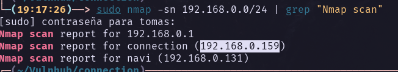
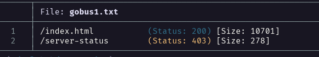
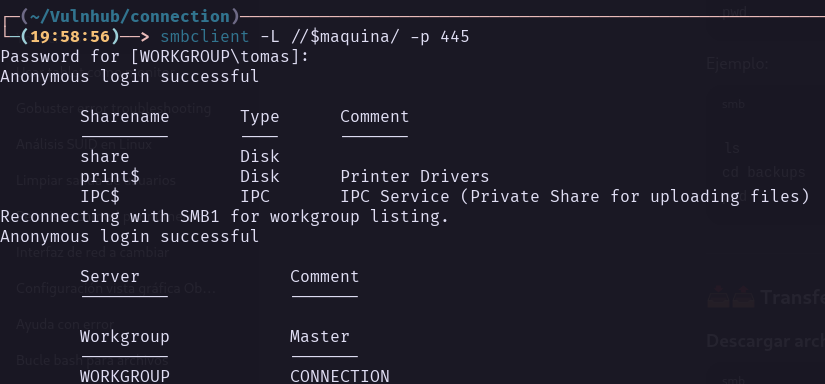
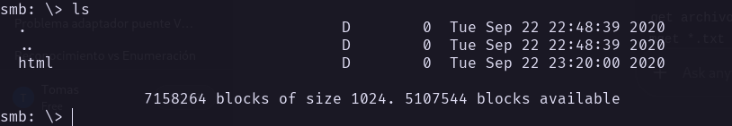
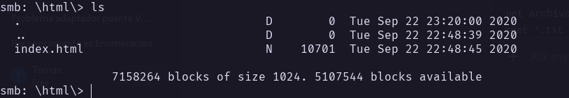
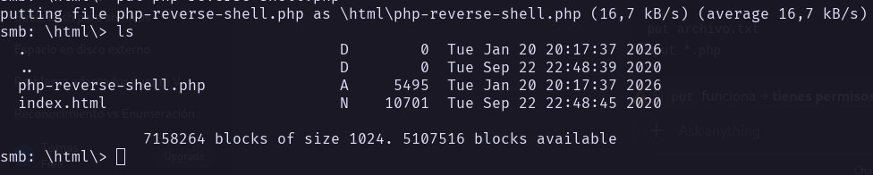
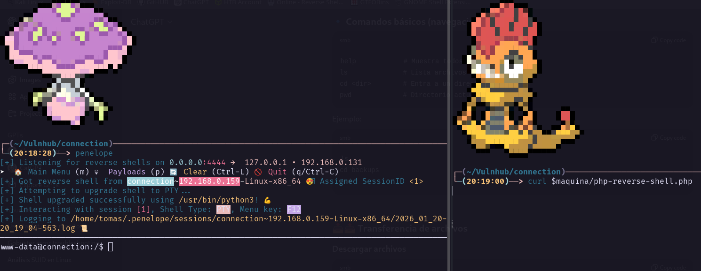
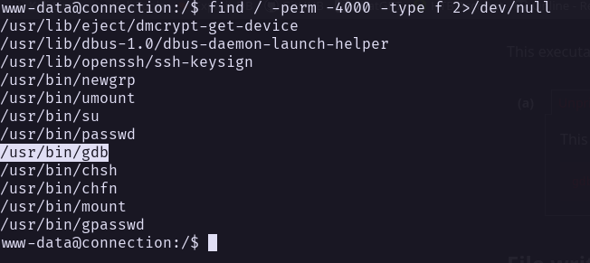
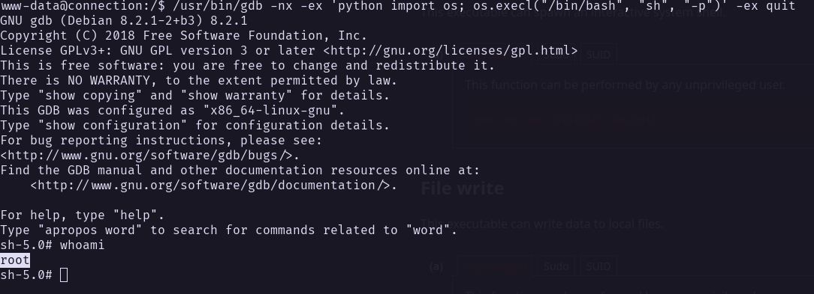

### Información General
- **Objetivo:** Conseguir acceso
- **IP:** 192.168.0.158
- **Hostname:** connection
- **Sistema Operativo:**
- **Arquitectura:**
- **Kernel:** Linux
- **TTL:** 64
- **Servicios expuestos:**
- **Tecnologías detectadas:** 

---
### Notas
-
---
## Writeup
---
### Hosts discovery (descubrimiento de hosts)



---
### Enumeración
```bash
# Nmap 7.95 scan initiated Tue Jan 20 19:19:08 2026 as: /usr/lib/nmap/nmap -p 22,80,139,445 -sCV -sS -Pn -vvv -oN nmap.txt -oX nmap.xml 192.168.0.159
Nmap scan report for connection (192.168.0.159)
Host is up, received arp-response (0.00032s latency).
Scanned at 2026-01-20 19:19:08 -03 for 12s

PORT    STATE SERVICE     REASON         VERSION
22/tcp  open  ssh         syn-ack ttl 64 OpenSSH 7.9p1 Debian 10+deb10u2 (protocol 2.0)
| ssh-hostkey: 
|   2048 b7:e6:01:b5:f9:06:a1:ea:40:04:29:44:f4:df:22:a1 (RSA)
| ssh-rsa AAAAB3NzaC1yc2EAAAADAQABAAABAQCxNh+4rTxFF/c8dZwGAg+SIl5zJE1Rq8y3vlHZ2P7gTdRQDb7XlWK8W5O0XVtBVqWlvLZlHIOniUJlSlcps51cHo58B9KczrZME5phRmiYLOo2pTBmra6sZADq7mmlHkpz1LbpmgzSGchrrp9pSxUjcdmpffhgd79i/q0d4ya7vK4R/tcegMNUxjkmW83JCu0Mc2qw3JvzqCQ5BGyrgGrsb4VguV/MZrPzX8nwM7i2ivsg+d171360aa9SXtoGELkBfeqCOKRCOckw2gfQlo2tsdc26jwimBygMPpkAH87zMJdl5iEX7p9tPr4ddIp9DtPjsSB3Cu2ObOr9iAYVvy5
|   256 fb:16:94:df:93:89:c7:56:85:84:22:9e:a0:be:7c:95 (ECDSA)
| ecdsa-sha2-nistp256 AAAAE2VjZHNhLXNoYTItbmlzdHAyNTYAAAAIbmlzdHAyNTYAAABBBNHVs0JAs/3OsoWURkn+P6KrjxC1zzMry+q3H+RX+UW05NQvD3NORKjL0gnr+LOumhE1cMGmCgMTcaJ41T5nbxM=
|   256 45:2e:fb:87:04:eb:d1:8b:92:6f:6a:ea:5a:a2:a1:1c (ED25519)
|_ssh-ed25519 AAAAC3NzaC1lZDI1NTE5AAAAIM9EVXAcxAJmQLNl3ttKL8QEWy+X+0R/rmS0tyt/bd2t
80/tcp  open  http        syn-ack ttl 64 Apache httpd 2.4.38 ((Debian))
|_http-title: Apache2 Debian Default Page: It works
| http-methods: 
|_  Supported Methods: GET POST OPTIONS HEAD
|_http-server-header: Apache/2.4.38 (Debian)
139/tcp open  netbios-ssn syn-ack ttl 64 Samba smbd 3.X - 4.X (workgroup: WORKGROUP)
445/tcp open  netbios-ssn syn-ack ttl 64 Samba smbd 4.9.5-Debian (workgroup: WORKGROUP)
MAC Address: 08:00:27:07:F7:DA (PCS Systemtechnik/Oracle VirtualBox virtual NIC)
Service Info: OS: Linux; CPE: cpe:/o:linux:linux_kernel

Host script results:
| smb-os-discovery: 
|   OS: Windows 6.1 (Samba 4.9.5-Debian)
|   Computer name: connection
|   NetBIOS computer name: CONNECTION\x00
|   Domain name: \x00
|   FQDN: connection
|_  System time: 2026-01-20T17:19:19-05:00
| smb2-security-mode: 
|   3:1:1: 
|_    Message signing enabled but not required
| smb-security-mode: 
|   account_used: guest
|   authentication_level: user
|   challenge_response: supported
|_  message_signing: disabled (dangerous, but default)
| smb2-time: 
|   date: 2026-01-20T22:19:19
|_  start_date: N/A
| p2p-conficker: 
|   Checking for Conficker.C or higher...
|   Check 1 (port 29583/tcp): CLEAN (Couldn't connect)
|   Check 2 (port 15794/tcp): CLEAN (Couldn't connect)
|   Check 3 (port 53522/udp): CLEAN (Failed to receive data)
|   Check 4 (port 55953/udp): CLEAN (Failed to receive data)
|_  0/4 checks are positive: Host is CLEAN or ports are blocked
|_clock-skew: mean: 1h39m59s, deviation: 2h53m12s, median: 0s
| nbstat: NetBIOS name: CONNECTION, NetBIOS user: <unknown>, NetBIOS MAC: <unknown> (unknown)
| Names:
|   CONNECTION<00>       Flags: <unique><active>
|   CONNECTION<03>       Flags: <unique><active>
|   CONNECTION<20>       Flags: <unique><active>
|   \x01\x02__MSBROWSE__\x02<01>  Flags: <group><active>
|   WORKGROUP<00>        Flags: <group><active>
|   WORKGROUP<1d>        Flags: <unique><active>
|   WORKGROUP<1e>        Flags: <group><active>
| Statistics:
|   00:00:00:00:00:00:00:00:00:00:00:00:00:00:00:00:00
|   00:00:00:00:00:00:00:00:00:00:00:00:00:00:00:00:00
|_  00:00:00:00:00:00:00:00:00:00:00:00:00:00

Read data files from: /usr/share/nmap
Service detection performed. Please report any incorrect results at https://nmap.org/submit/ .
# Nmap done at Tue Jan 20 19:19:20 2026 -- 1 IP address (1 host up) scanned in 11.92 seconds

```

| Vector | Servicio (Puerto) | Estado  | Qué permite                         | Qué intentar                                  | Notas |
| ------ | ----------------- | ------- | ----------------------------------- | --------------------------------------------- | ----- |
| 1      | ssh (22)          | abierto | Acceso autentificado al sistema     | Buscar usuarios                               |       |
| 2      | HTTP (80)         | abierto | Toda clase de vulenrabiliadades web | Enumeración de dirtorios, etc                 |       |
| 3      | netbios-ssn (139) | abierto | Compartir recursos                  | Enumerar recursos, directorios, uduarios, etc |       |
| 4      | netbios-ssn (443) | abierto | Compartir recursos                  | Enumerar recursos, directorios, uduarios, etc |       |

Primero busque en la pagina web, superficialmete, pero al no encontrar nada enumere archivos, pero parece que no van por ahi los tiros:



Ahora toca enumerar samba 

### Samba


Como se vio en el escaneo, hay acceso anonimo 

Tenemos una carpeta share, parece ser un directorio, podrias este ser el directorio de /var/www/html?



Solo un index.html, la probabilidad de que sea /var/www/html aumentan



---
### Explotación
Teniendo en cuenta que es muy posible que el directorio de smb sea /var/www/html hice una prueba directamente con una php-reverse-shell





Funciono!

---
### Post Explotación

---
### Escalada de privilegios
Primero busque binarios con SUID de root



Consulte y resulta que gdb permite escalar privilegios


